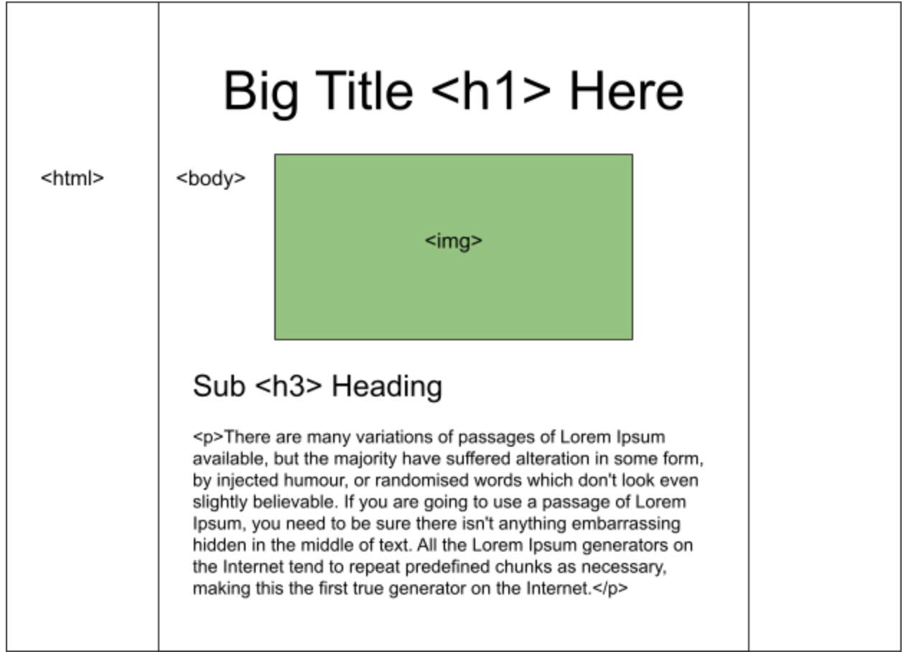

# IT115-GitHub-Web-Page
## Github Web Page Assignment

[## Website link](https://gina-noel.github.io/IT115-GitHub-Web-Page/)

## Roles
* Repository Owner/Creator (Creates repository, approves pull requests/merges, make sure page is published/viewable via github pages): Gina
* Researcher(s) (researches topic): Everyone
* Writer(s) (writes content for the page): Alexis
* Developer (takes content and formats in HTML): Emmy, Christine
* Designer (adds CSS/styles, wireframe): Ted, Devon

## Topic
### Basics of Web Design

### Research/Brain Dump section
We can all do a little research on the topic and add/link it here.

This page about color-blindness and color palettes is kind of cool. Maybe we can just use a palette from there. Color theory, etc
Fonts: serif, sans serif etc
Presentation: Headings, subheadings, how pages get sectioned, and what that means for the navigation of a page. (old site examples w/ different layouts maybe old trends). 

How visually impaired people view the web(Gina)

(Ted)There is always an object or purpose to any web page. In this article by Alan Smith, the author talks about a CTA, or a “Call to Action.” Whether you want viewers to sign up, make a purchase, or simply find and view the content you are publishing, this CTA must be very clear and apparent from the instant they see the page. He encourages designers to make sure the call to action is the very first element a user sees when they view a page. 
(Ted)Here is an article about print/web design, in which the author talks about how a visual grid system for displaying text and documents has its roots in the first century (possibly older)

### Writing section
Writing of the main content will go here. Formatting will be helpful for the person who takes the content and puts it in HTML

### History of Web design
The very first website on the World Wide Web was created by Tim Berners-Lee who designed the website at the Swiss research center, CERN (European Organization for Nuclear Research). You can still access the basic CERN website which was developed for the purpose of distributing information to other researchers
link text
what is web design
Web design refers to the design of websites that are displayed on the internet. It usually refers to the user experience aspects of website development rather than software development. ... A web designer works on the appearance, layout, and, in some cases, content of a website..
link text

### Style guide/ideas
Let’s agree on some general styling guidelines, even though maybe only one or two people will ultimately write the CSS, we can all contribute ideas here. For example, we can agree on a font, main/highlight colors, etc.

We will be embedding citations within the article with <a> tags.

### Wireframe

##  Work Log
### Newest entries added at the top.

* 11/4/2021 (Gina) Added more collaborators, added the readme file to the project, formated the document and added wireframe image to it, commented on pull requests (40 min)
* 11/3/2021 (Devon) Added more styling to the styles.css. This includes the backgrounds, padding and text decoration. (35 min)
* 11/3/2021 (Devon) Added css consistent with wireframe, created divisions inside the index.html file for ease of access to elements, changed reference links into buttons. (30 min)
* 11/2/2021 (Ted) finished wireframe, added some content to google doc, started adjusting styles of web page (30 min)
* 11/2/2021 (Ted) spent time with team assigning and discussing roles, determining topic, added css and image folders, started wireframe (60 min)
* 11/2 (Christine) Assisted team members with Slack (2 min), Met with group to discuss topic (30 min) and worked on HTML with Emmy (30 min)
* 11/2 (Gina) Created our github repository, added collaborators and troubleshooted some issues regarding cloning (40 min). Researched topic and images (20)
* 11/2/2021 (Ted) Created Google Doc, shared with team on Slack, added some sections to document (20 min)
* 10/30/2021 (Devon) Created Slack channel for our team (10 min)
